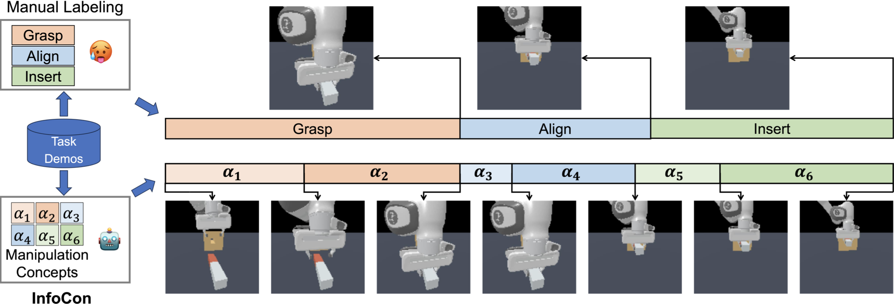
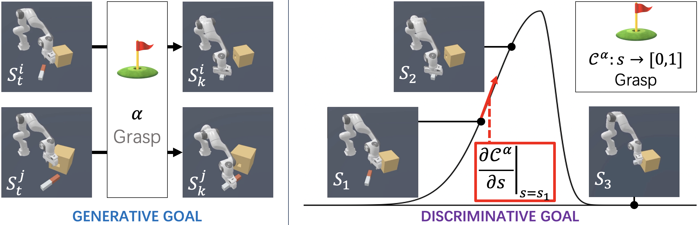

# InfoCon
This is the official repository for: **[InfoCon: Concept Discovery with Generative and Discriminative Informativeness](https://openreview.net/forum?id=g6eCbercEc&referrer=%5BAuthor%20Console%5D(%2Fgroup%3Fid%3DICLR.cc%2F2024%2FConference%2FAuthors%23your-submissions))**

<p align="center">
  <br>
</p>
<p align="center">
  <br>
</p>

## Environment
### Hardware & OS

64 CPUs, NVIDIA GeForce RTX 3090 (NVIDIA-SMI 530.30.02, Driver Version: 530.30.02, CUDA Version: 12.1), Ubuntu 20.04.6 LTS (GNU/Linux 5.15.0-83-generic x86_64)
### Installation

```
conda create -n infocon python=3.9
source activate infocon
pip install -r requirements.txt
```

## Usage

### Training InfoCon
Use `train.sh` in director `/`. Parameters:
<details>

`n_iters` Number of training iterations.

`batch_size` Batch size.

`init_lr` The initial learning rate.

`weight_decay` Weight decay coefficient.

`beta1` Beta1 in the AdamW optimizer.

`beta2` Beta2 in the AdamW optimizer.

`dropout` Dropout probability.

`lr_schedule` Learning rate schedule. Selection: `CosineAnnealingLRWarmup`, `MultiStepLR`

`t_warmup` (Make sure you're using `CosineAnnealingLRWarmup`) Number of warming-up iterations

`milestones` (Make sure you're using `MultiStepLR`) Number of iterations before decay lr

`gamma` (Make sure you're using `MultiStepLR`) Decay of lr after each milestone step

`n_head` Number of attention heads.

`n_embd` Hidden feature dimension.

`dim_key` Hidden feature dimension.

`dim_e` Hidden feature dimension.

`n_key_layer` Number of attention layers in KeyNet.

`n_rec_layer` Number of attention layers in RecNet.

`n_future_layer` Number of attention layers in FutureNet.

`vq_n_e` How many kinds of keys in the key_book.

`vq_use_r` Use learnable radius of prototype.

`vq_coe_ema` type=str default='0.95' ema moving rate.

`vq_ema_ave` action='store_true' average or not

`KT` type=str default='1.0' Temperature for classifier

`vq_use_ft_emb` action='store_true' use frequent time step embedding

`vq_use_st_emb` action='store_true' use spherical time step embedding

`vq_st_emb_rate` default='1.2' type=str division rate for time sphere embedding

`vq_coe_r_l1` default='0.0' type=str l1 regularization on length of every prototype

`vq_use_prob_sel_train` action='store_true' If true, using prob sample when training

`vq_use_timestep_appeal` action='store_true' If true, prototype will move close to time in time interval

`coe_cluster` default='0.1' type=str cluster weight

`coe_rec` default='1.0' type=str reconstruction weight from key_soft

`use_decay_mask_rate` action='store_true' mask cluster item when it's policy is too large

`sa_type` default='gpt' type=str choices=['gpt', 'egpt', 'egpthn', 'resfc', 'hn'] type of sa_net

`n_state_layer` default=1 type=int Number of layers for state prediction in SANet

`n_action_layer` default=1 type=int Number of layers (after state prediction) for action prediction in SANet

`use_pos_emb` action='store_true', if True, use key energy gradient to evaluate effect of key states, only use when resfc

`use_skip` action='store_true' if True, use skip connection for HN generated net when using HN

`use_future_state` action='store_true' if True, we will append the future states

`model_name` default='TEST' type=str Model name (for storing ckpts).
    
`from_model_name` default='' type=str Name of the pretrained module.

`from_ckpt` default=-1 type=int Ckpt of pretrained module.

`task` type=str default='PegInsertionSide-v0' Task (env-id) in ManiSkill2.

`control_mode` type=str default='pd_joint_delta_pos' Control mode used in envs from ManiSkill2.

`obs_mode` type=str default='state' State mode used in envs from ManiSkill2.

`seed` default=0 type=int Random seed for data spliting.

`num_traj` default=-1 type=int Number of training trajectories.

`context_length` type=int default=60 Context size of CoTPC (the maximium length of sequences sampled from demo trajectories in training).

`min_seq_length` type=int default=60 Mininum length of sequences sampled from demo trajectories in training.

`save_every` default=10 type=int Save module every [input] epoch.

`log_every` default=10 type=int log metrics every [input] iters.

`num_workers` default=5 type=int A positive number for fast async data loading.

`multiplier` type=int default=52 Duplicate the dataset to reduce data loader overhead.

`train_half` action='store_true' train half (do not optimize gen goal loss)

`train_mode` default='scratch' type=str training mode

</details>

### Labeling by InfoCon
Use `label.sh` in director `/`. Parameters:
<details>
Releasing :)
</details>>

### CoTPC Evaluation

<!--
## CoTPC-main/
relates to CoTPC downstream policies.
* **data**: ManiSkill2 data-set.
* **maniskill2_patches**: Some patching code in ManiSkill2 for CoTPC logs. Refer to CoTPC GitHub Repo for details...
* **scripts**: bash scripts for CoTPC training and evaluation.
* **src**: src code related to CoTPC policies.
* **save_model**: checkpoints of CoTPC policies.
## src/
includes the codes of InfoCon, where
* **modules** includes the used DNN modules
  * **GPT.py**: Transformers used in InfoCon
  * **VQ.py**: VQ-VAE used in InfoCon. It is a little bit different from vanilla VQ-VAE. We've tried many kinds of design. Currently we are using **VQClassifierNNTime**.
  * **module_util.py**: Other modules, like some MLPs, time step embedding modules.
  * (currently other source file are unused)
* **autocot.py**: construct different modules into whole InfoCon. Refer to it for the main pipeline of InfoCon.
* **data.py**: load data.
* **vec_env.py**: Relate to ManiSkill2. Vectorize Environments.
* **train.py**: python scripts for InfoCon training.
* **path.py**: log of data and checkpoint file paths.
* **callbacks.py**: Customized Callbacks for PyTorch Lightning training of InfoCon.
* **label.py**: python scripts for labeling key states. Labeled out key states will be stored as .txt file in **CoTPC-main/data/$TASK_DIR$**.
* **his.py**: calculate Human Intuition Score (HIS) when given labeled out key states.
* **util.py**: other modules and functions.
-->


